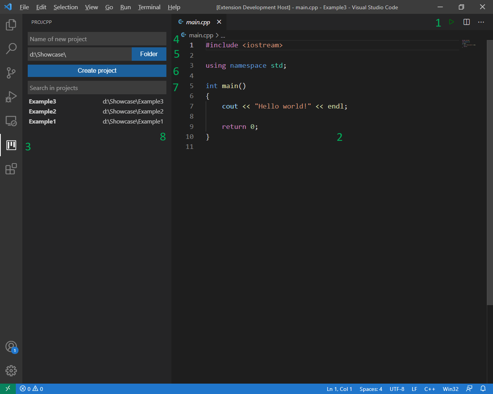

<h2 align="center"> ProjCpp </h2>

C++ project manager and build helper

## Table of Contents
- [Goal](#goal)
- [Main features](#features)
- [Inspiration](#inspiration)

## Goal 
- This extension was made with beginner programmers in mind
- The goal of this project is to create an extension that helps the setup of a c/c++ workflow
- My vision for now is to provide an easy-to-use project manager and a way to setup c/c++ building by the press of a button

## Main features 

### There are 2 main parts to this extension:
#### 1: Building
- A "Play" button is added in the top-right corner of the editor (Editor Actions) <b>(1)</b>
- When pressed, it looks for a compiler either in the path environment variable, or in the usual install locations of [CodeBlocks](https://www.codeblocks.org/)
- If an installed compiler was not found, the user is prompted to either choose a different installed compiler, or if they want to let the extension download it
- If download is chosen, the extension downloads the [64bit MinGW compiler](https://sourceforge.net/projects/mingw-w64/files/Toolchains%20targetting%20Win32/Personal%20Builds/mingw-builds/8.1.0/)
- When the download completes, the user is prompted to choose the desired extract location of the compiler
- Upon extraction, its added to the path environmental variable
- After all this, a VSCode restart is needed in order for the shells to update
- If everything went without errors, you're good to go! :)
- <i>This part is confirmed to be working on Linux and Windows, with any shell</i>
#### 2: Project managing
- A "project icon" is added to the left sidebar, from which the projects can be managed <b>(3)</b>
- The first input field <b>(4)</b> is for the name of a new project, and the second one <b>(5)</b> is for the root location of the projects (every created project will be created there)
- The "Create project" button <b>(6)</b> creates a folder (recursively) with the name and location from the previous inputs and creates a "main.cpp" sample file <b>(2)</b>
- Below that mini-form is a list of the projects in the root project directory (these are looked recursively as well, meaning that if a directory only has more directories inside, and no files, then the extension looks into those directories as well) in no particular order <b>(7)</b>
- There is a search field to filter the projects by path <b>(8)</b>
- <i>This part is now working on both Windows and Linux</i>

## Inspiration 
- At school, we were introduced to programming with the help of [CodeBlocks](https://www.codeblocks.org/), which is a fine program, but it's a bit unstable and ugly for my uses.
- That's why I moved to VSCode and used a small bash script for project managing
- In the spirit of learning, I thought to make a small extension with the same features as that script, but visually and integrated into VSCode

## Thank you for the attention, and I hope you like this extension!
### All contributions are well appreciated!